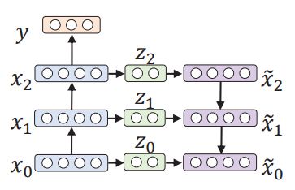

# CROSR PyTorch
- This repo is based on https://github.com/saketd403/CROSR, which is a PyTorch implementation for "Classification-Reconstruction Learning for Open-Set Recognition", CVPR 2019. 
- The original repo was not plug and play, so I added some modifcations and made it ready to use on CIFAR10.

# Operating Environment
This repo was tested on Windows 10 with python 3.10 and a Nvidia 3080 GPU card. It is assumed that Linux is also supported.
- `torch` version used: `1.12.1+cu113`
- `libmr` version used: `0.1.9`

# Requirements
See requirements.txt
```py
torch
torchvision
PIL
scipy
sklearn
cython
libmr
tabulate
```
# Usage
## 1. Input

### If your are using the CIFAR10 dataset:  
- Download the dataset from https://www.kaggle.com/c/cifar-10.   
The downloaded content should contain the following:   
    ```ps
    sampleSubmission.csv
    test.7z
    train.7z
    trainLabels.csv
    ```
- Unzip train.7z, and move the unzipped `train` folder and `trainLabels.csv` to `data\input_data_cifar10`.
    ```bash
    $ ls .\data\input_data_cifar10\
    train
    trainLabels.csv
    ```
## 2. Edit Config
Open `configs\config.py` and edit the following.
```py
data_root_dir='data'# path to a folder used to store the input and output of this repo
dataset='cifar10'# [cifar10,parcels_256]
image_side_length=32 # 32 for cifar10, 256 for parcels
channes=3# 3 for rgb images
num_classes=6 # number of classes learned duing training. 
# In case of cifar 10, 6 classes are used for training, 4 classes are outliers

```

## 3. Rearrange input data to fit ImageFolder 
### Cifar10 
```ps
py convert_cifar10_input_2_fit_torch.py
```
- This script produces a `torchvision.datasets.ImageFolder-like` dataset folder and places it at `data\cifar10`.
- Writing a dataloader is another option.
- We use 6 classes from cifar10 as training classes(or known classes), and the remaining 4 classes as outlier classes. The train-val split is 8:2.
    ```ps
    Training_data: 	80s% of   [cat, deer, dog, frog, horse, ship]
    val_data: 		20% of   [cat, deer, dog, frog, horse, ship]
    Testing_data:	100% of  [airplane, automobile, bird, truck]
    ```
## 4. train_dhr
```ps
py train_dhr.py
```
- This script trains a Deep Hierarchical Network, and saves it at `data/[dataset]/saved_models`.
- In the case of CIFAR10, the DHR network has the following architecture:  


- The model is trained to minimize classification loss+ reconstruction loss.

    ```py
    cls_criterion = nn.CrossEntropyLoss()
    reconst_criterion = nn.MSELoss()
    ...
    loss = cls_loss + reconst_loss
    ```

## 5. get_model_features
```ps
py get_model_features.py
```
- This script invokes the trained Deep Hierarchical Network, and computes the activation vectors on the images in folders `train`,`test` and `val`. The activation vectors are stored in `saved_features\[dataset]`.
- In our case, we define the activation vector as `logits + latent vectors`, where ‘+’ denotes tensor concatenation. 
    ```txt
    logits is a tensor with shape [1,6] 
    latent vector 1 is a tensor with shape [1,32] 
    latent vector 2 is a tensor with shape [1,32] 
    latent vector 3 is a tensor with shape [1,32] 
    Thus the activation vector is  [1,6] +[1,32] +[1,32] +[1,32] =[1,102]
    ```
- note that in this step, validation features are copied into `data\saved_features\cifar10\train`, because we want to include validation features in MAV computation in the next step.
## 6. MAV_Compute
```ps
py MAV_Compute.py
```
- This script computes the mean activation vectors of correctly classified training images per training class . The result is stored in `saved_MAVs\[dataset]`.
- The MAV is computed in the following manner:
    ```py
    for each training class:
        mav= torch.mean(correct_features)
    ```
## 7. Compute Distances
```ps
py compute_distances.py
```
- This script computes the distances between the av and the mav for each correctly classified image in the training set in each class. The distances are stored in `data\saved_distance_scores`.
    ```py
    for each class:
        for each correctly classified images in the training set:
            computes the distance between av to the mav
    ```
- distance is a linear combination of euclidean distance and cosine distance
    ```py
    import scipy.spatial.distance as spd
    distance=spd.euclidean(mean_vector, feat)/200. +  spd.cosine(mean_vector, feat)
    ```
## 8. Weibull Fitting
```ps
py weibull_fitting.py
```
- This script fits per class weibull models on the distances in the training set. The weibull models are stored in `data\saved_weibull_model`.
    ```ps
    for each class:
        sort the distances 
        take the 20 largest distances and fit a weibull distribution
    ``` 

## 9. Computing OpenMax Scores
```py
py compute_openmax.py
```
- This script loops through the features in `['test','val']`, and computes open set scores for each feature. The open set scores and the auc curve are stored in `data\saved_openset_scores\cifar10`.
    ```py
    for images in [val,test]:
        for each class in [training]:
            distance = compute_distance(av, category_mav)
            wscore = category_weibull_model.w_score(distance)
            update category logit based on wscore
        computeOpenMaxProbability
    ```
- open set scores
    ```bash
    $ py .\compute_openmax.py  
    saved openset scores exist, removing
    average open set scores for in-distribution images : 0.077310
    average open set scores for out-of-distribution images : 0.291468
    The AUROC is 0.743661
    ```
- The auroc is .74.  Note that we only trained for 50 epochs, there may be more space for improvement.

   

## 10. Analyze Results
- open set acc
    ```bash
    $ py .\analyze_results.py
    Ratio of images classified as unknown in val: 383 / 6000 = 0.063833
    acc = 0.695833
    Ratio of images classified as unknown in test: 6006 / 20000 = 0.300300
    acc = 0.300300
    ```
